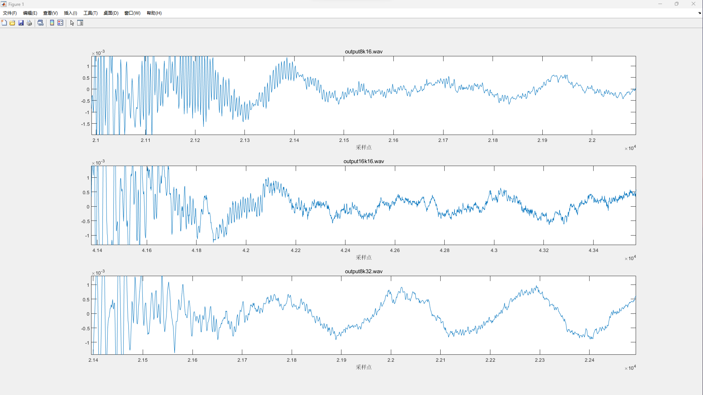
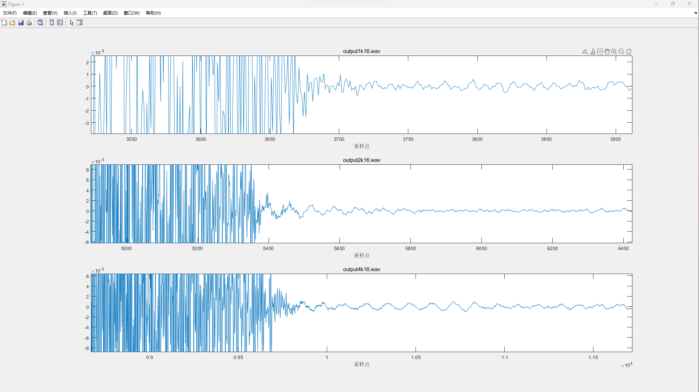
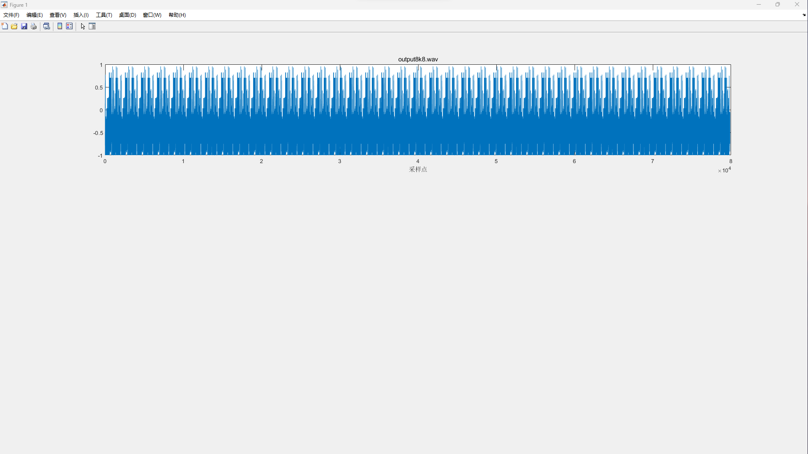

# 语音信号采集

本次实验语音信号采集使用了pyaudio库，由zyc同学奉献激情人声,声音采集函数如下

```py
def record_audio(wave_out_path,record_second):
    CHUNK = 1024               # 每次读取的采样点数
    FORMAT = pyaudio.paInt16   # 采样格式2byte
    CHANNELS = 1               # 单声道
    RATE = 8000                # 采样率（每秒采样点数）
    p = pyaudio.PyAudio()
    stream = p.open(format=FORMAT,
                        channels=CHANNELS,
                        rate=RATE,
                        input=True,
                        frames_per_buffer=CHUNK)
    wf = wave.open(wave_out_path, 'wb')
    wf.setnchannels(CHANNELS)
    wf.setsampwidth(p.get_sample_size(FORMAT))
    wf.setframerate(RATE)
    print("\* recording")
    for i in tqdm(range(0, int(RATE / CHUNK \* record_second))):
        data = stream.read(CHUNK)
        wf.writeframes(data)
    print("* done recording")
    stream.stop_stream()
    stream.close()
    p.terminate()
    wf.close()   
```

采集的语音文件在wav_zyc中，以下为语音的波形图片




可以看出采样率越高，声音细节越完善。量化精度带来了保真度。量化精度为8位时信号严重失真，推测可能是设备兼容问题导致的

## 采样率

-高采样率可以更精确地捕捉原始模拟信号中的细节，特别是高频部分。这对于音频质量的保留非常重要，尤其是对于音乐等高保真度要求的音频。
-较低的采样率可能导致信号失真，特别是在高频部分，因为它们不能准确地表示原始信号的高频信息。

## 量化精度

-较高的量化精度允许更多的动态范围，即可以表示更大幅度的音频信号，这有助于音频的高保真度和动态范围。
-较低的量化精度会导致量化误差，特别是在较强的信号部分，这可能导致噪音和畸变。

## 语音质量评估

使用了[NISQA](https://github.com/gabrielmittag/NISQA)模型对语音质量进行评估。得到的结果保存在wav_zyc_eval中

| deg | mos_pred |
| ----------- | ----------- |
|output_16k_16.wav|2.5901012|
|output_1k_16.wav|1.5833876|
|output_2k_16.wav|1.3315139|
|output_4k_16.wav|2.2182028|
|output_8k_16.wav|2.8488872|
|output_8k_32.wav|2.558274|
|output_8k_8.wav|0.5491741|
